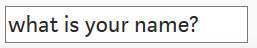
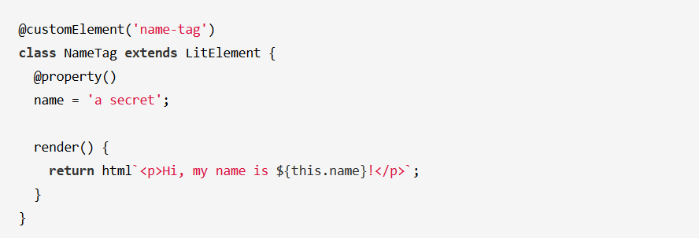

import future from "@mdx-deck/themes/future";
import highlight from "@mdx-deck/themes/syntax-highlighter-prism";
import { Split } from "@mdx-deck/layouts";
import { Notes } from 'mdx-deck'
import { Title, Slide, Section, Image, theme } from "./adesso";

export const themes = [theme, highlight];

<Title bg={1}>

# Workshop

## Web Components

<Notes>
# Lesenswert

*** Specs
- https://github.com/w3c/webcomponents

*** Intro to Web components:
- https://developer.mozilla.org/en-US/docs/Web/Web_Components
- https://www.webcomponents.org/introduction
- https://css-tricks.com/an-introduction-to-web-components/
- https://dev.to/thepassle/web-components-from-zero-to-hero-4n4m
- https://hacks.mozilla.org/2018/11/the-power-of-web-components/
- https://developers.google.com/web/fundamentals/web-components/

*** web componets Beispiele:
- https://github.com/mdn/web-components-examples

*** Frameworks:
- https://stenciljs.com/docs/introduction
- https://angular.io/guide/elements
- https://lit-element.polymer-project.org/
- https://www.polymer-project.org/

</Notes>
</Title>

---


<Section bg={2} logo="white">

# Motivation/ Einleitung
<Notes>
    - erzählen wer wir sind
    - warum beschäftigen wir uns mit web components
    - fragen anderen wer die sind und was die machen
    - stellen Agenda für heute
</Notes>

</Section>

---

<Slide>

# Noch Ein JS Framework?


</Slide>

---

<Slide>

# Warum jetzt web componets?

- Frameworks haben eigenes Weg um DOM zu erzeugen und kontrollieren
- verlassen sich auf document.querySelector 
- unterschiedliche Vorgehensweise 
- reagieren auf Seiten-Änderungen auf document Ebene


</Slide>

---

<Slide>

# was sind web components?

"Web components are a set of web platform APIs that allow you to create new custom, reusable, encapsulated HTML tags to use in web pages and web apps."

</Slide>

---

<Slide>

# was bedeutet das genau?
- Standardisiertes Weg um eigene HTML Elemente zu definieren und erweitern
- Kleine verschachtelte Komponenten 
- Reagieren auf DOM Änderungen, wie z.B. Nachladen
- Überall einsetzbar (Frameworks, HTML Dokumenten ...)

```html
<dw-cookie visible> Wir verwenden Cookies...</dw-cookie>
```

</Slide>

---

<Slide>

# History

- erste Version in 2014, pushed von Polymer Team, Google (V0)
- seit Version 63, implementierte Mozilla Custom Elements und Shadow DOM
- V1 seit Januar 2017
- Living Standard seit 2018 

<Notes>
- V0 hatte z.B. andere Methoden (createdCallback -> connectedCallback )

</Notes>

</Slide>


---

<Slide>

# Specifications

- Custom Elements
- Shadow DOM
- HTML Template
- HTML Modules

<Notes>
- web components ist eine Gruppe von Technologien
- siehe Standard: https://github.com/w3c/webcomponents
- HTML Modules sind noch nicht Living Standard. Nachfolger von HTML Imports
- Specs sind maintained von unterschiedlichen Gruppen: HTML Standards, DOM Standards, CSS WG
</Notes>

</Slide>

---


<Slide>

# Specifications
- 4 Verschiedene Technologien die von unterschiedliche Arbeitsgruppen entwickelt sind
- 3 davon Living Standard und unterstützt von vielen Browsers
- HTML Modules Standard ist noch in Entwicklung

<Notes>
- HTML Modules ist noch Proposal, siehe hier: https://github.com/w3c/webcomponents/blob/gh-pages/proposals/html-modules-proposal.md

</Notes>

</Slide>

---

<Section bg={2} logo="white">

# Custom Elements


</Section>

---

<Slide>

# Custom Elements / Built-in Elements

<Image src="./adesso/images/Element_properties_Ancestry.png" />

<Notes>
- hier soll standard html element Vererbung erklärt werden
- in Fall von input der erbt von HTMLElement aber bringt auch eigenes Funktionalität, wie z.B. value, type usw.
</Notes>
 

</Slide>

---


<Slide>

# Built-in Elements
- Ein Teil der Custom Componets Standard
- Built-in Elements Technologie ermöglicht Erweiterung eines HTML-Element
- Normales HTML mit der Attribut <b>is</b> ausstatten


<Notes>
- Built in Elements sind ein Teil der Custom Components Specification
- Ermöglichen Erweiterung eines HTML Element

</Notes>

</Slide>

---

<Slide>

# Built-in Elements
### Normales Input Element
```html
 <input type="text"></input>
```

### Built-in
```html
 <input is="dw-input" type="text"></input>
```

</Slide>

---

<Slide>

# Built-in Elements
```JS
class YourClassName extends HTMLInputElement{
    constructor(){
        super();
        this.value = "what is your name?"
    }
}
window.customElements.define("your-tag", YourClassName, {extends: "input"});

```
<Notes>
- hier sich nur auf this.value fokusieren
- alles andere erzählen wir in custom componets Teil
</Notes>

</Slide>

---

<Slide>

# Built-in Elements
```html
<input is="your-tag"></input>
```


</Slide>

---

<Slide>

# Custom Elements
- Ermöglichen ganz neues HTML Element zu kreieren
- Wie es aussieht? (Per Default keine Styles)
- Wie es funktioniert? (Erbt nur stanard HTML Element Verhalten)
- Built-in Elements bieten uns begrenztes Erweiterungsmöglichkeit

</Slide>

---

<Slide>

# Custom Elements  
### Neues HTML Element
```html
<your-tag></your-tag>
```
<Notes>
- weil die Erweiterung von built ins nicht ausreicht können wir eigene Elemente erstellen
</Notes>

</Slide>

---

<Slide>

# Custom Elements  
### Was kann ich damit machen?
```html
<your-tag></your-tag>
```

</Slide>

---

<Slide>

# Custom Elements JS Boilerplate
```JS
class YourClassName extends HTMLElement{
    constructor(){
        super();
        /* define your element .... */
    }
}
window.customElements.define("your-tag", YourClassName);
```

<Notes>
- weil die Erwieterung von built ins nicht ausreicht können wir eigene Elemente erstellen
</Notes>

</Slide>

---

<Slide>

# Custom Elements Constructor
- Definieren eines Custom Elements
```JS
class YourClassName extends HTMLElement{
    constructor(){
        super();
        /* define your element .... */
    }
}
```
<Notes>
- erklären warum wir hier extenden müssen 
- super() kurz erklären
</Notes>
</Slide>

---

<Slide>

# Custom Elements Registry

#### Custom Element

```js
window.customElements.define("your-tag", YourClassName);
```
#### Built-in
```js
window.customElements.define("your-tag", YourClassName, {extends: "input"});
```
<Notes>
- in regitry kann man eigene Elemente definieren und auch abfragen welche da sind
- in dem built-in Fall kommt noch ein Parameter von typ Objekt dazu
extends: "input" z.B.
</Notes>

</Slide>


---

<Slide>

# Custom Elements 
 ```html
 <dw-input theme="blue"></dw-input>
 ```
<Notes>
- eigenes html, yeah.... aber ist das Valides HTML?
</Notes>
</Slide>

---

<Slide>

# Custom Elements 
1. Custom Elements Tags müssen immer mit "-" geschrieben werden und können nicht einzelne Worte sein
2. können nicht Einzelwörter sein 

* Falsch:  "meineKomponente" 
* Richtig:  "meine-komponente" 
* Richtig:  "meine-gelbe-komponente" 

</Slide>

---

<Slide>

# Custom Elements 

```JS
class DWInput extends HTMLElement{
    constructor(){
        super()
       /*  */
    }
}
window.customElements.define("dw-input", DWInput);

```
<Notes>
- kleines Beispiel von JS Teil der Custom web componet 
</Notes>

</Slide>

---

<Slide>

# Custom Elements 
## Demo #1
</Slide>


---
<Slide>

# Übung #1

1. Definiere ein eigenes "custom" HTML Tag 
2. Kreiere ein Custom Element Objekt
3. Wenn initialisiert, es soll in JS-definiertes Text rendern (z.B. eigene Name) 

<Notes>
- steht noch offen welches Element wir nehmen können
Mein Vorschlag: 
- Visitenkarte 
*** hat Bild, Name und Email. Das Bild hat src die später ausgetauscht werden kann und auch die Name und Email können per attributen getauscht werden 
</Notes>
</Slide>

---

<Section bg={3} logo="white">

# Shadow DOM


</Section>

---

<Slide>
  
# Shadow DOM  

"Web components are a set of web platform APIs that allow you to create new custom, reusable, <i>encapsulated</i> HTML tags to use in web pages and web apps."

- Fokus auf "encapsulated" 


</Slide>

---

<Slide>

# Shadow DOM  

  - per Definition ist es möglich "encapsulated" Komponenten zu kreieren
  - alles innerhalb eine Komponente definiert (HTML, CSS)
    

</Slide>

---

<Slide>

<Image src="./adesso/images/shadow-root-elements.png" />

<Notes>
- erklären dass das shadowRoot ein neues typ von Element ist
- 
</Notes>  

</Slide>

---

<Slide>

```JS
// shadow-root nodeType = 11
// document-fragment
```    
- document-fragment ist vereinfachte Version des document
- eine hat kein Einfluss auf das andere

<Notes>
- vergleich mit iframes erwähnen 
</Notes>
</Slide>

---

<Slide>
    
# Shadow DOM  

```JS
class DWInput extends HTMLElement{
    constructor(){
       super();
        const shadowRoot = this.attachShadow({mode: 'open'});
        // shadowRoot.appendChild(yourChild);
    }
}
window.customElements.define("dw-input", DWInput);

```
<Notes>

- open vs closed  mode
- open bevorzügt 
- in closed hat man kein Zugriff auf Inhalte in Shadow DOM, ein Beispiel von closed ist html 5 video Tag

</Notes>

</Slide>

---

<Slide>

# Shadow DOM  
## Demo #2


</Slide>

---

<Slide>

# Übung #2
- Übung #1 mit Shadow DOM erweitern
- Eigenes Text jetzt in shadowRoot rendern

</Slide>

---

<Slide>

# Shadow DOM Styles
- Möglichkeit um CSS zu definieren der nur für Komponente gültig ist 

<Notes>
- Beispiel wie andere Framework das schaffen (css Klasse: some_ysda84874)
</Notes>

</Slide>

---

<Slide>

# Shadow DOM Styles
```JS

    constructor(){
       super();
        const shadowRoot = this.attachShadow({mode: 'open'});
        const style = document.createElement('style');
        style.textContent = `p { color: red; }`;
        shadowRoot.appendChild(style);
    }
```

</Slide>

---

<Slide>

# Shadow DOM  Styles
## Demo #3


</Slide>

---

<Slide>

# Übung #3
- Eigene shadowRoot Styles definieren

</Slide>

---

<Section bg={5} logo="white">

# HTML Templates/ Slots

</Section>

---

<Slide>

# HTML Templates
- ein Teil der web components Standard 
- bietet Möglichkeit "reusable" Templates zu definieren 
- definiert in HTML oder JS

</Slide>

---

<Slide>

# HTML Templates
```html
<template id="dw-template">
    <p> Das ist ein Text </p>
</template>
// Bleibt auf der Seite unsichtbar
```

</Slide>

---

<Slide>

# HTML Templates
- Neues HTML Tag "template"
- Bleibt unsichtbar bis es initialisiert ist
- Soll mit ID ausgestattet werden 

</Slide>

---

<Slide>

# HTML Templates
```JS

    constructor(){
       super();
        const shadowRoot = this.attachShadow({mode: 'open'});
        const template = document.querySelector('#dw-template');
        const templateContent = template.content;
        shadowRoot.appendChild(templateContent.cloneNode(true));
    }
```

</Slide>

---

<Slide>

# HTML Templates
- wie gewohnt aus document abfragen
- dessen Inhalte ins shadowRoot einfügen

</Slide>

---

<Slide>

# HTML Templates
## Demo #4


</Slide>

---

<Slide>

# Übung #4
- schreibe eigene HTML Template
- füge die ins shadowRoot ein

</Slide>

---

<Slide>

# HTML Slots
- Teil der Template Standard
- Bietet Möglichkeit Platzhalter zu definieren

</Slide>

---

<Slide>

# HTML Slots
- auf zwei Stellen definiert:
1. In HTML Teil der web-Komponente
2. In Template HTML

</Slide>

---

<Slide>

# HTML Slots 
- in HTML Teil der Web-Komponente definieren wir den Inhalt
- das Inhalts-Element ist mit der Attribut "Slot" ausgestattet
```html
<dw-cookie visible> <div slot="cookie-text">Wir verwenden Cookies...</div></dw-cookie>
```

</Slide>

---

<Slide>

# HTML Slots 
- in Template definieren wir den Platzhalter
- in Template Tag sind Slots mit eigenem Tag definiert
- Haben entsprechend die Name gesetzt
```html
<template id="dw-cookieTemplate">
    <slot name="cookie-text"></slot>
</template>
```

</Slide>

---

<Slide>

# HTML Slots in JS
```JS
    constructor(){
       super();
        const shadowRoot = this.attachShadow({mode: 'open'});
        const template = document.querySelector('#dw-cookieTemplate');
        const templateContent = template.content;
        shadowRoot.appendChild(templateContent.cloneNode(true));
    }
```

</Slide>

---

<Slide>

# HTML Slots in HTML
```html
<template id="dw-cookieTemplate">
    <slot name="cookie-text"></slot>
</template>
<dw-cookie visible> <div slot="cookie-text">Wir verwenden Cookies...</div></dw-cookie>
```

</Slide>

---

<Slide>

# HTML Slots
## Demo #5

</Slide>

---

<Slide>

# Übung #5
- Eigene Slots in Template Definieren
- Inhalt für Slots in der Web-Komponente HTML definieren

</Slide>

---

<Section bg={4} logo="white">

# Callbacks


</Section>

---

<Slide>

# Callbacks
- Bestandteil eine Komponente
- Ermöglichen Kontrolle bei Änderungen

</Slide>

---

<Slide>

# Callbacks
- connectedCallback
- disconnectedCallback
- adoptedCallback
- attributeChangedCallback

</Slide>

---

<Slide>

# connectedCallback
- passiert bei jedem Einfügen, und Schieben der Komponente HTML
- kann mehrmals aufgerufen werden
- wenn die Komponente auf inneren oder äußeren DOM abhängig ist


</Slide>

---

<Slide>

# connectedCallback
```JS
    constructor(){
       super();
    }
    connectedCallback(){
        // bei Zugriff auf DOM 
        // Beispiel: Berechnete Styles abfragen
    }
```

</Slide>

---

<Slide>

# disconnectedCallback
- bei "disconnecten" oder löschen von der Seite 
```JS
    constructor(){
       super();
    }
    disconnectedCallback(){
        // Beispiel: setzte alles auf null 
        // oder remove eventListeners
    }
```

</Slide>

---

<Slide>

# adoptedCallback
- bei Schieben der Komponente zu anderen document, z.B. iframe
- soll nur in komplexen Fällen benutzt werden wo connectedCallback nicht ausreicht

<Notes>
- nur kurz erwähnen, ist nur in komplexen fällen zu benutzen 
</Notes>

</Slide>

---

<Slide>

# adoptedCallback
```JS
    adoptedCallback(){
        // Beispiel: 
        // wechsel der ownerDocument
        // HTML -> iframe mit adoptNode()  
    }
```
</Slide>

---

<Slide>

# Callbacks
## Demo #6

</Slide>

---

<Slide>

# attributeChangedCallback
- Ermöglicht Kontrolle über Attributen Änderungen (Add, Edit, Remove)
- Eigene Komponenten "native-like" machen 
- Bietet dem Anwender Möglichkeit der Inhalt zu Ändern
- Zum Beispiel: reagieren auf "Theme" Attribut Änderung  

</Slide>

---

<Slide>

# attributeChangedCallback
- besteht aus zwei Teilen:
1. callback Methode
2. static get "observedAttributes"

</Slide>

---


<Slide>

# attributeChangedCallback
1. callback Methode (attributeChangedCallback)
- wird jedes Mal ausgeführt bei Attributen Änderungen

</Slide>

---


<Slide>

# attributeChangedCallback
1. static get observedAttributes
- definieret auf welchen Attributen die callback Methode reagieren soll

</Slide>

---

<Slide>

# attributeChangedCallback
```JS
static get observedAttributes(){
    // return ist immer ein Array
    return ['text-color']
}
constructor(){super}
attributeChangedCallback(attrName, oldValue, newValue){}
```

</Slide>

---

<Slide>

# Callbacks attributeChangedCallback
## Demo #7

</Slide>

---

<Slide>

# Übung #6
- Die Komponente soll sich wie ein HTML Element Verhalten
- Es soll entsprechend auf Attributen-Änderungen reagieren
- Wenn der Benutzer ein Attribut z.B. "color" ändert, es soll auch in der Komponente angezeigt werden

</Slide>

---

<Section bg={6} logo="white">

# Polyfills


</Section>

---

<Slide>

# Polyfills
- kleine Bibliotheken die Browser um eine Technologie erweitern
- dadurch können z.B. ältere Versionen von Browsers profitieren

</Slide>

---

<Slide>

# Polyfills


</Slide>

---

<Slide>

# Polyfills
- Obwohl web componets "living-standard" sind, brauchen ältere Versionen oder verschiedene Browsers polyfills 
- empfohlenes polyfill:
https://www.webcomponents.org/polyfills

<Notes>
- TODO:
</Notes>

</Slide>

---

<Slide>

# Polyfills
- können zu Performance Reduzierung führen
- manche Technologien lassen sich nicht "polyfillen", z.B. shadow DOM in IE 11 (Über shadyCSS möglich)

<Notes>
- shadyCSS macht das gleiche was andere framework machen, kreiert einzigartige css Klassen 
- ist mit Vorsicht zu genießen, vor allem bei langsamere Browsers (paradox)
</Notes>
</Slide>

---

<Slide>

# Polyfills Einbindung
```html
<!-- load the webcomponents loader, which injects the necessary polyfill bundle -->
<script src="node_modules/@webcomponents/webcomponentsjs/webcomponents-loader.js"></script>

<!-- load the element -->
<script type="module" src="my-element.js"></script>

<!-- use the element -->
<my-element></my-element>
```

</Slide>

---

<Section bg={7} logo="white">

# Frameworks


</Section>

---

<Slide>

# Frameworks
## Warum Frameworks?

- Erweitern Funktionalität
- Erleichtern Aufsetzen von Dev Umgebung
- Sparen Boilerplate Code


</Slide>

---

<Slide>

# Frameworks
## Ein paar bekannte Frameworks:

1. Polymer Project
2. Angular Elements
3. Stencil

</Slide>

---


<Slide>

# Frameworks
## Polymer Project

- Bibliotheken und Tools für bauen von web components
- zwei bekannteste Librarys:
1. lit-html
2. LitElement

</Slide>

---

<Slide>

# lit-html

- schnelle HTML-Templating Library
- bauen und updaten von JS HTML Templates
- re-rendering nur von diffs

</Slide>

---

<Slide>

# lit-html

```js
const myTemplate = (name) => html`
    <div>
      Hi, my name is ${name}.
    </div>
`;
```
</Slide>

---


<Slide>

# LitElement

- Custom Components base class
- erweitert die Custom Componente mit z.B. neuen Callbacks
- Komponenten und Properties werden mit Annotations deklariert

</Slide>

---

<Slide>

# LitElement


</Slide>

---


<Slide>

# Frameworks
## Angular Elements
- Angular Elements gebaut zu web components
- Custom components mit angular Elements features wie change detection, data binding und dynamic content (HTML)
- Registrieren sich wie normale Custom Components 
- können einzeln ins HTML eingebunden werden 

</Slide>

---

<Slide>

# Angular Elements
## Registrierung Ablauf


</Slide>

---

<Slide>

# Angular Elements
## Angular Element nach export

```html
<my-popup message="Use Angular!"></my-popup>

```

</Slide>

---

<Slide>

# Stencil

>Stencil is a toolchain for building reusable, scalable Design Systems. Generate small, blazing fast, and 100% standards based Web Components that run in every browser.

</Slide>

---

<Slide>

# Stencil
- erweitert Webcomponets mit neuen callbacks, props/attributes
- TypeScript per Default
- JSX oder React Style HTML
- Implementiert Dev umgebung
- Polyfills 
- 100% web componetns zu Laufzeit

</Slide>

---

<Slide>

# Stencil
```js
import { Component, Prop, h } from '@stencil/core';
@Component({
  tag: 'my-first-component',
})
export class MyComponent {
  // Indicate that name should be a public property on the component
  @Prop() name: string;

  render() {
    return (
      <p>
        My name is {this.name}
      </p>
    );
  }
}


```

</Slide>

---


<Slide>

# Stencil
```html
<my-first-component name="Max"></my-first-component>
```

</Slide>

---

<Slide>

# Stencil
## Decorators
* @Component() declares a new web component
* @Prop() declares an exposed property/attribute
* @State() declares an internal state of the component
* @Watch() declares a hook that runs when a property or state changes
* @Element() declares a reference to the host element
* @Method() declares an exposed public method
* @Event() declares a DOM event the component might emit
* @Listen() listens for DOM events
// TODO: schöner machen 

</Slide>

---
<Slide>

# Stencil
## Callbacks
* connectedCallback() 
* disconnectedCallback() 
* componentWillLoad() 
* componentDidLoad() 
* componentWillRender() 
* componentDidRender() 
* componentWillUpdate()
* componentDidUpdate()
* render()

// TODO: schöner machen 

</Slide>

---

<Slide>

# Stencil
## Stencil show-off
// TODO: einen Stencil Projekt aufsetzten und zeigen 
</Slide>

---

<Section bg={8} logo="black">

# Implementation bestehende Komponenten 


</Section>

---

<Slide>

# Implementation bestehende Komponenten 
- web components sind Valides HTML
- lassen sich in jedes Framework einsetzen 
- größer Auswahl einzelne Komponenten z.B.

1. https://www.webcomponents.org/elements
2. https://www.npmjs.com/search?q=keywords:web-components

</Slide>

---

<Slide>

# Implementation bestehende Komponenten  
- um bestehende Komponenten zu importieren hat man mehrere Möglichkeiten:
1. Als npm Paket ins Projekt importieren
2. Als Script in HTML Document
3. Als JS modul in eine andere JS Datei

</Slide>

---
