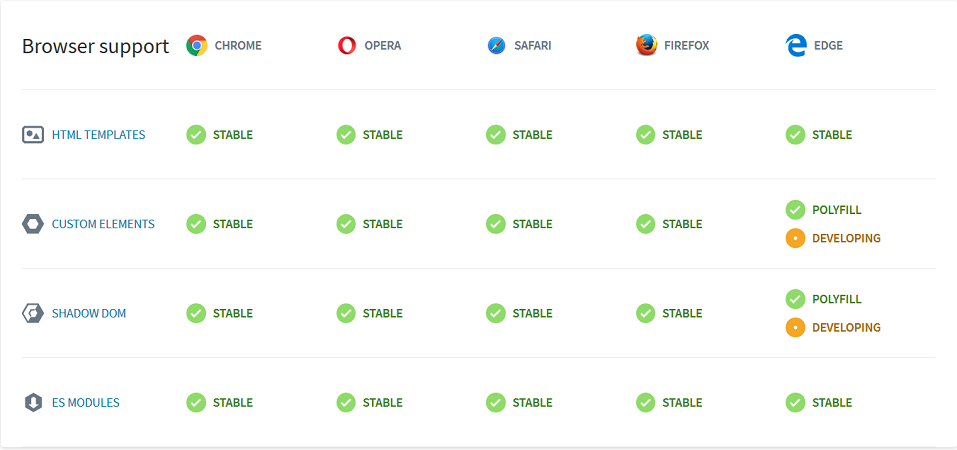

import future from "@mdx-deck/themes/future";
import highlight from "@mdx-deck/themes/syntax-highlighter-prism";
import { Split } from "@mdx-deck/layouts";
import { Notes, Appear } from 'mdx-deck'
import { FullScreenCode } from 'mdx-deck';
import { Title, Slide, Section, Image, theme } from "./adesso";

export const themes = [theme, highlight];


<Title bg="rgb(241, 237, 233)">

# Web Components Workshop
## Irhad Kulanic & Lukas Korten

</Title>

---

<Section bg="#618792" logo="white">

# Ein weiteres Framework?  

</Section>

---

<Section bgSrc="./adesso/images/JS-Frameworks.png" logo="white"></Section>

---

<Slide>

# Web Components    

- Eine Gruppe von Webtechnologien
- benutzerdefinierte und wiederverwendbare HTML-Elemente
- in sich gekapselte Funktionalität
- einsetzbar auf allen Webseiten und in allen Frameworks

<Notes>
# Datepicker als Beispiel nennen:
Wieviele Datepicker wurden in den letzten Jahren immer wieder aufs neue implementiert, 
um in dem letzten gehypten JavaScript-Framework zu funktionieren? 
Mit Web Components soll sich das Blatt wenden: 
Die Komponente wird einmal implementiert und kann überall wiederverwendet werden.
</Notes>

</Slide>

---

<Slide>

# Die Haupttechnologien

<ul>    
    <li>Custom Elements</li>
    <li>Shadow DOM</li>
    <li>HTML-Templates</li>
    <Appear>
        <li>(ES Modules)</li>
    </Appear>
</ul>

<Notes>
- siehe Standard: https://github.com/w3c/webcomponents
- HTML Modules sind noch nicht Living Standard. Nachfolger von HTML Imports
- Specs sind maintained von unterschiedlichen Gruppen: HTML Standards, DOM Standards, CSS WG
- von unterschiedlichen Arbeitsgruppen entwickelt
- sind Living Standard und werden von allen modernen Browsern (Ausnahme Edge)
</Notes>

</Slide>

---

<Section bg="#774251" logo="white">

# Custom Elements
## Benutzerdefinierte HTML-Elemente

</Section>

---

<Slide>

# Custom Elements

`CustomElementRegistry`
* Controller für benutzerdefinierte Elemente
* global über `customElements` zugreifbar

<br/>

`CustomElementRegistry.define()` - registriert ein neues Custom Element

**Argumente**
* Name des Elements (Ein `-` im Namen ist Pflicht)
* Das Verhalten definierende Klassenobjekt 

<Notes>
    - CustomElementRegistry ist ein Controler für Custom Elements in einem Web-Dokument
    - darüber kann ein Custom Element registriert und Informationen über ein vorhandenes abgefragt werden
</Notes>

</Slide>

---

<Slide>

# Custom Elements

**Das Klassenobjekt**
* ES 2015 Standardsyntax für Klassen


```
class MyPopup extends HTMLElement {     
    constructor() { 
        super(); // muss immer als erstes aufgerufen werden

        // Funktionalität des Elements
        ...    
    }
}
```

</Slide>

---

<Slide>

# Custom Elements

**Zwei Arten**
* autonome Custom Elements
* erweiterte Standardelemente (built-in elements)

</Slide>

---

<Slide>

# Custom Elements

**Autonome Custom Elements**
* erben direkt vom `HTMLElement`
* nicht von Standardelementen wie z.B. `HTMLInputElement`
* Name kann als Tag verwendet werden

</Slide>

---

<Slide>

# Custom Elements

```
class MyPopup extends HTMLElement {     
    constructor() { ... }
}

customElements.define('my-popup', MyPopup);
```

</Slide>

---

<Slide>

# Custom Elements

Kann mit dem Namen `my-popup` erzeugt werden
* JavaScript
```
document.createElement('my-popup');
```
* HTML
```
<my-popup></my-popup>
```
</Slide>

---

<Slide>

# Custom Elements

**Erweiterte Standardelemente (Built-in Elements)**
* erben von Standardelementen
* Beim Erstellen Angabe des erweiterten Standardelement-Tags erforderlich
* Mit dem Attribut `is` wird der Name des Elements angegeben

</Slide>

---

<Image src="./adesso/images/Element_properties_Ancestry.png" width="80vw"/>

<Notes>
- hier soll die Vererbung erklärt werden
- HTMLInputElement erbt von HTMLElement und bringt eigene Funktionalität mit, z.B. value, type usw.
</Notes>

---


<Slide>

# Custom Elements

```
class MyAlert extends HTMLParagraphElement { 
    constructor() { ... } 
}

customElements.define('my-alert', MyAlert, { extends: 'p' });
```

</Slide>

---

<Slide>

# Custom Elements

Beim Erzeugen muss das Attribut `is` angegeben werden 

* JavaScript
```
document.createElement('p', { is: 'my-alert' });
```

* HTML
```
<p is="my-alert"></p>
```

</Slide>

---

<Section bg="#618792" logo="white">

# DEMO 1
## Custom Element   

</Section>

---

<Slide>

# Übung 1 - Ein Custom Element implementieren

Implementiert eine Visitenkarte als ein **automares Custom Element**. 
Die Visitenkarte soll die folgende HTML-Struktur haben:

```html
<div class="contact-card">
    
    <div class="content">
        <h1>Max Mustermann</h1>
        <p class="mail">max.mustermann@example.com</p>
        <button>Profilbeschreibung</button>
        <div class="details"><p>Lorem ipsum...</p></div>
    </div>
</div>

```
Einstiegsdatei: `Uebung_1-CustomElements/index.js`. 

</Slide>

---

<Section bg="#774251" logo="white">

# Shadow DOM
## Kapselung von CSS und HTML

</Section>

---

<Slide>

# Shadow DOM  

* ein isollierter *Subtree* mit eigenem Markup und Styling
* wird unabhängig vom DOM des Hauptdokuments gerendert
* kolliediert nicht mit Skripten und Styles des Hauptdokuments
* Elemente im Shadow DOM sind über `document.querySelector()` nicht zugreifbar
    
<Notes>
- Skripte und Styles können angewendet werden, ohne dass sie mit anderen Teilen des Dokuments kollidieren
</Notes>

</Slide>

---

<Slide>

# Shadow DOM  

<Split>


</Split>

<Notes>
- shadow-root nodeType = 11
- document-fragment  
- document-fragment ist eine vereinfachte Version des document
- das eine hat keinen Einfluss auf das andere
- Vergleich mit iFrames 
</Notes>

</Slide>

---

<Slide>

# Shadow DOM  

* **Shadow host** - Der DOM-Knoten, an dem das Shadow DOM hängt
* **Shadow tree** - Der DOM-Tree (Struktur) des Shadow DOM
* **Shadow boundary** - Der Geltungsbereich des Shadow DOM
* **Shadow root** - Der Root-Knoten des DOM-Tree 

</Slide>

---

<Slide>

# Shadow DOM

```
class MyComponent extends HTMLElement {    
    constructor() {
        super();
        
        this.attachShadow({ mode: 'open' });        
        const childElement = document.createElement('p');
        this.shadowRoot.appendChild(childElement);               
    }
}
customElements.define("my-component", MyComponent);
```

<Notes>

Unterschied zwischen 'open' und 'closed': 
Mit 'open' kann über shadowRoot auf Elemente zugegriffen werden, mit 'closed' nicht

</Notes>

</Slide>

---

<Slide>

# Shadow DOM
* `open` vs `closed`


</Slide>

---

<Section bg="#618792" logo="white">

# DEMO 2
## Shadow DOM 

</Section>

---

<Slide>

# Übung 2 - Shadow DOM

In dieser Übung soll das bereits entwickelte Custom Element `MyContractCard` mit Shadow DOM erweitert werden.
Einstiegsdatei mit zusätzlichen Hinweisen: `uebungen/Uebung_2-ShadowDOM/index.js`

</Slide>

---

<Slide>

# Shadow DOM Styles

- Im Shadow DOM definiertes CSS wirkt sich nur auf angehängte Elemente aus 
- globales CSS hat keinen Einfluss auf Elemente im Shadow DOM 
- Mit `:host` - Das Wurzel-Element der Web Component selektieren

```css
:host {
    font-family: sans-serif;
    ...
}
```

<Notes>
- Beispiel wie andere Framework das schaffen (css Klasse: some_ysda84874)
</Notes>

</Slide>

---

<Slide>

# Shadow DOM Styles

```
constructor(){
    super();
    
    const style = document.createElement('style');
    style.textContent = `p { color: red; }`;
    
    this.attachShadow({ mode: 'open' });
    this.shadowRoot.appendChild(style);
}
```

</Slide>

---

<Section bg="#618792" logo="white">

# DEMO 3
## Shadow DOM - Styles im Shadow DOM definieren

</Section>

---

<Slide>

# Übung 3 - Shadow DOM Styles

Eigenes `style`-Element auf der `shadowRoot` definieren und damit das Darstellungsproblem aus der Übung 2 korrigieren.
Die Einstiegsdatei für diese Übung ist `uebungen/Uebung_3-ShadowDOM_Styles/index.js`.


</Slide>

---

<Section bg="#774251" logo="white">

# HTML Templates und Slots
## Einsatz von `<template>` und `<slot>` Elementen

</Section>

---

<Slide>

# HTML Templates
- wiederverwendbare Markup-Vorlagen
- sind im HTML-Dokument enthalten, werden aber vom Browser nicht angezeigt
- dienen als Grundlage für wiederverwendbare Elemente 
- können sehr effizient geklont werden
- können im HTML oder JavaScript definiert werden

<Notes>

Werde vom HTML-Parser ignoriert:  
Bilder werden nicht geladen, Skripte nicht ausgeführt, eingebundene Custom-Elements nicht initialisiert und aktualisiert usw.

</Notes>

</Slide>

---

<Slide>

# HTML Templates
- neuer HTML-Tag `<template>`
- bleibt auf der Seite unsichtbar bis es initialisiert wurde
- benötigt eine `id`

**HTML**
```html
<!-- Bleibt auf der Seite unsichtbar -->
<template id="dw-template">
    <p>Das ist ein Text</p>
</template>
```
**JavaScript**
```
const template = document.querySelector('#dw-template');
```

</Slide>

---

<Slide>

# HTML Templates
```
...
constructor(){
    super();
    this.attachShadow({mode: 'open'});

    const template = document.querySelector('#dw-template');        
    this.shadowRoot.appendChild(template.content.cloneNode(true));
}
...    
```

</Slide>

---

<Slide>

# HTML Templates

```
const myTemplate =  document.createElement('template');
myTemplate.innerHTML = `
    <p>I'm an encapsulated paragraph in a web component</p>
`;
...
constructor(){
    super();
    this.attachShadow({mode: 'open'});
    this.shadowRoot.appendChild(myTemplate.content.cloneNode(true));
}
...
```

</Slide>


---

<Section bg="#618792" logo="white">

# DEMO 4
## HTML Templates

</Section>

---

<Slide>

# Übung 4 - HTML Template verwenden

In dieser Übung wollen wir uns mit Templates befassen. Lagert alle Kindelemente aus `MyContractCard`
in ein Template aus. Das Template soll in der JavaScript-Datei `index.js` implementiert und an die `shadowRoot` angehängt werden. 

Einstieg: `uebungen/Uebung_4-HTMLTemplate/index.js`


</Slide>

---

<Slide>

# HTML Slots

- Markup-*Einschübe* an vordefinierten Stellen im `<template>`

```html
<template id="info-alert-template">
    <div>
        <h1>Info</h1>
        <slot></slot>
    </div>
</template>

<my-info-alert>
    <p>Eine ganz wichtige Meldung</p>
</my-info-alert>

```

</Slide>

---


<Slide>

# HTML Slots

- Markup-*Einschübe* an vordefinierten Stellen im `<template>`

```html
<template id="info-alert-template">
    <div>
        <h1>Info</h1>
        <slot><p>Kein Inhalt ...</p></slot> <!-- Defaultwert -->
    </div>
</template>

<my-info-alert>
    <p>Eine ganz wichtige Meldung</p>
</my-info-alert>

```

</Slide>

---


<Slide>

# HTML Slots

- mehrere `<slot>`-Tags innerhalb eines Templates möglich
- mit dem Attribut `name` den Namen des `<slot>` definieren

```html
<template id="info-alert-template">
    <div>
        <slot name="title">
            <h1>Info</h1>
        </slot>
        <slot name="message">
            <p>Kein Inhalt ...</p>
        </slot>
    </div>
</template>
```

</Slide>

---

<Slide>

# HTML Slots
- mit `slot="name-des-slots"` den passenden `<slot>`ansprechen


```html
<my-info-alert>
    <h1 slot="title">Benutzerdaten aktualisiert</h1>
    <p slot="message">
        Die Benutzerdaten für Max Mustermann konnten ...
    </p>
</my-info-alert>
```

</Slide>

---

<Section bg="#618792" logo="white">

# DEMO 5
## HTML Slots

</Section>

---

<Slide>

# Übung 5 - HTML Slots
In dieser Übung soll das vorhandene Template mit einem `slot`-Element erweitert werden. 
Das benutzerdefinierte Markup, welches die Benutzer zwischen den Tags der `my-contact-card`-Web Component eingeben, 
soll an der Stelle des Standardtextes im `.details`-Container erscheinen.

Einstiegsdatei: `uebungen/Uebung_5-HTMLSlot/index.js`

</Slide>

---

<Section bg="#774251" logo="white">

# Properties & Events
## Input und Output einer Web Component

</Section>

---

<Slide>


</Slide>

---


<Slide>

# Events

- gehört zum öffentlichen API einer Web Component
- andere Komponenten über eigene Ereignisse informieren
- Einsatz der `CustomEvent` API 
- mit `EventTarget.dispatchEvent()` Event auslösen

<Notes>

    Andere Komponenten können wie gewohnt über addEventListener() auf solche Ereignisse reagieren
</Notes>

</Slide>

---


<Slide>

# Events

```
// my-button.js

const template = document.createElement('template');
template.innerHTML = `<button>Klick mich</button>`;

class MyButton extends HTMLElement {    
    ...
}

customElements.define('my-button', MyButton);
```

</Slide>

---

<Slide>

# Events

```
// my-button.js
...
constructor() {
    super();
    this.attachShadow({mode: 'open'});
    this.shadowRoot.appendChild(template.content.cloneNode(true));
    this.buttonElement = this.shadowRoot.querySelector('button');
    this.buttonElement.addEventListener('click', () => this.handleClick());
}
handleClick() {
    this.dispatchEvent(new CustomEvent('my-click', { detail: 'Klick!'} ));
}
...
```

</Slide>

---

<Slide>

# Events

```
// index.js

import './my-button.js';

const button = document.querySelector('my-button');
button.addEventListener('my-click', e => console.log(e));

```

</Slide>

---

<Slide>

# Properties

- öffentliches API einer Web Component
- dynamisch Eigenschaften verändern
- `set` und `get`-Methoden für jede Property definieren
- beim Setzen (wenn nötig) Elemente aktualisieren

<Notes>
    - Warum brauchen wir überhaupt Properties? Wir wollen  
    dynamisch Eigenschaften einer Web Component verändern.
</Notes>

</Slide>

---

<Slide>

# Properties

```
// my-button.js

const template = document.createElement('template');
template.innerHTML = `<button>Klick mich</button>`;

class MyButton extends HTMLElement {    
    ...
}

customElements.define('my-button', MyButton);
```
<Notes>

    span-Element als Variable speichern

</Notes>

</Slide>

---

<Slide>

# Properties

```
const template = document.createElement('template');
template.innerHTML = `<button>Klick mich</button>`;

class MyButton extends HTMLElement {
    set label(value) {
        this._label = value;
        this.buttonElement.innerText = this._label;
    }
    get label() {
        return this._label;
    }
    constructor() { ... }
    ...
}

customElements.define('my-button', MyButton);
```

</Slide>

---

<Slide>

# Properties

```
// index.js

import './my-button.js';

const button = document.querySelector('my-button');
button.label = 'Speichern';
button.addEventListener('my-click', e => console.log(e));

```

</Slide>


---

<Section bg="#774251" logo="white">

# Attribute
## Eigenschaften im HTML festlegen

</Section>

---


<Slide>

# Attribute

```html
<!-- index.html -->

<my-button></my-button>

```

</Slide>

---

<Slide>

# Attribute

```html
<!-- index.html -->

<my-button label="Speichern"></my-button>

```

</Slide>

---

<Slide>

# Attribute

```
class MyButton extends HTMLElement {
 
    static get observedAttributes() {
        return ['label'];
    }
    ...
    


}
```

</Slide>

---

<Slide>

# Attribute

```
class MyButton extends HTMLElement {
 
    static get observedAttributes() {
        return ['label'];
    }
    ...
    attributeChangedCallback(attrName, oldValue, newValue) {
        if (attrName === 'label') {
            this.label = newValue;
        }
    }
}
```

</Slide>

---

<Section bg="#618792" logo="white">

# DEMO 6
## Attribute, Properties & Events   

</Section>

---

<Section bg="#774251" logo="white">

# Callbacks
## Der Lebenszyklus eines Custom Elements

</Section>

---

<Slide>

# Callbacks
- in jedem Custom Element enthalten
- steuern das Verhalten einer Web Component
- ermöglichen Eingriffe bei speziellen Ereignissen und Änderungen

</Slide>

---

<Slide>

# Callbacks
- connectedCallback
- disconnectedCallback
- attributeChangedCallback
- adoptedCallback

können im Lebenszyklus **mehrmals** aufgerufen werden

</Slide>

---

<Slide>

# Callbacks
`connectedCallback`

- wird aufgerufen, wenn das Element in das DOM des Dokuments eingebunden wird
- nützlich, wenn das Element vom innerem oder äußerem DOM abhängig ist

```
...
connectedCallback() {
    // z.B. berechnete Styles abfragen
    // oder auf das DOM zugfreifen
}
...
```

</Slide>

---

<Slide>

# Callbacks
`disconnectedCallback`

- wird aufgerufen, wenn das Element vom DOM des Dokuments getrennt wird

```
...
disconnectedCallback() {
    // z.B. Properties zurücksetzen
    // oder EventListener entfernen
}
...
```

</Slide>

---

<Slide>

# Callbacks
- wenn eines der Element-Attribute hinzugefügt, gelöscht oder verändert wurde

`attributeChangedCallback`

```
...
attributeChangedCallback(attrName, oldValue, newValue) {
    if (attrName === 'label') {
        this.label = newValue;
    }
}
...

```


</Slide>

---

<Slide>

# Callbacks
`adoptedCallback`

- wenn das Element in das DOM eines anderen Dokuments verschoben wird (z.B. `iframe`)
- nur da wo `connectedCallback` nicht ausreichend ist

```
...
adoptedCallback() {
    // Beispiel: Das Element wurde mit adoptNode() in ein iframe bewegt
}
...

```

<Notes>
- nur kurz erwähnen, ist nur in komplexen Fällen zu benutzen 
- wenn die adoptNode() Methode benutzt wurde
</Notes>

</Slide>

---

<Section bg="#618792" logo="white">

# DEMO 7
## Callbacks  

</Section>

---

<Slide>

# Übung 6 - Properties, Attribute und Events

In dieser Übung geht es um Deklaration benutzerdefinierter Properties und Attribute 
und das Auslösen von benutzerdefinierten Events.

Einstiegsdatei: `uebungen/Uebung_6-Callbacks-Attributen/index.js`

</Slide>

---

<Section bg="#774251" logo="white">

# Browser-Support & Polyfills
## Support für Web Components

</Section>

---

<Slide>

# Browser-Support

- alle Webkit und Chromium Browser (Chrome, Safari, Opera)
- Firefox ab Version 63
- Edge arbeitet aktiv an der Implementierung
- IE kein Support

</Slide>

---

<Slide>

# Browser-Support



</Slide>

---
<Slide>

# Browser-Support

**Zwei Probleme:**
- kein Support für ES2015 Features, wie Klassen und Module
- Web Component APIs werden nicht unterstützt

<Notes>
    IE unterstützt Klassen und Module nicht
    Edge hat aktuell noch keinen vollständigen Support für Web Component APIs
</Notes>

</Slide>


---

<Slide>

# Browser-Support

**Lösung:**
- Support für ES2015 Features: **Babel** oder **Typescript** einsetzen
- Web Component APIs unterstützten: **Polyfills** einsetzen

<Notes>
    Es gibt verschiedene Wege, um JavaScript von ES2015 zu ES5 zu übersetzen: Babel und Typescript sind die gängisten.
    Transpiling werden wir uns aus Zeitgründen nicht näher anschauen, sei hier nur erwähnt, dass es möglich ist.
    Weiter geht's mit Polyfills.
</Notes>

</Slide>

---

<Slide>

# Polyfills
- kleine JavaScript-Bibliotheken, welche die fehlenden Technologien im Browser nachbilden
- ältere Browser Versionen können somit unterstützt werden
- können zu Einschränkungen der Performanz führen
- einige Technologien lassen sich nicht nachbilden, z.B. shadow DOM im IE 11

Empfohlene Polyfills: https://www.webcomponents.org/polyfills

<Notes>
    shadow DOM kann im IE 11 mit shadyCSS nachgebildet werden.
    Ist jedoch mit Vorsicht zu genießen, vor allem in langsamen Browsern (paradox)
</Notes>

</Slide>

---

<Slide>

# Polyfills 

**Einbindung**
- `webcomponents-loader` lädt das passende Polyfill-Bundle nach

```html
<!-- webcomponents-loader einbinden -->
<script src="..webcomponentsjs/webcomponents-loader.js"></script>
<!-- Web Component laden -->
<script type="module" src="my-element.js"></script>

<!-- Web Component nutzen -->
<my-element></my-element>
```

</Slide>

---

<Section bg="#618792" logo="white">

# DEMO 8
## Polyfills   

</Section>

---

<Section bg="#774251" logo="white">

# Frameworks
## effiziente Entwicklung von Web Components

</Section>

---

<Slide>

# Frameworks

- effizientes Arbeiten
- kein Boilerplate Code
- je nach Library oder Framework `npm` erforderlich 

</Slide>

---

<Slide>

# Frameworks

- lit-html und LitElement (Polymer)
- Angular Elements
- Stencil

</Slide>

---

<Slide>

# lit-html 

- HTML-Templating-Library für JavaScript
- entwickelt vom Polymer-Project-Team
- extrem schnell
- kein virtuelles DOM Diffing
- aktualisiert nur geänderte Template-Zweige
- Verschachtelung und Komposition möglich

<Notes>

Polymer-Project arbeitet an unterschiedlichen Libraries, Tools und Standards rund um das Thema Webentwicklung.

</Notes>

</Slide>

---

<Slide>

# lit-html 

- nutzt HTML-Strings
- Templates werden in Funktionen ausgelagert
- können wiederholt mit unterschiedlichen Daten aufgerufen werden
- `TemplateResult` ist das Ergebnis eines solchen Aufrufs
- mit `render()` kann das Egebnis endgültig gerendert werden

```
let template = (name) =>  html`
	<h1>Hallo {name}!</h1>`;

const result = template('Joe');
render(result, document.body);    
```

<Notes>
    vor der geschweiften Klammer muss ein $-Zeichen stehen
    mdx-deck macht hier Probleme
    Library ist sehr mächtig: Event-Listener, Verschachtelung und Komposition möglich
</Notes>

</Slide>

---


<Slide>

# LitElement

- Basisklasse für eigene Custom Elements
- zusätzliche API, um Properties und Attribute zu verwalten
- bei Änderungen von Properties werden entsprechende Elemente automatisch aktualisiert

```
import { LitElement, html } from 'lit-element';

class MyComponent extends LitElement {			
    ....
}
customElements.define('my-component', MyComponent); 

```

</Slide>

---

<Slide>

# LitElement

```
class MyComponent extends LitElement {			
    static get properties() {
        return {
            name: {type: String}
        }
    }    
    render() {
        return html`<p>Hallo {this.name}</p>`;
    }
}

```

</Slide>


---


<Slide>

# Angular Elements

- `createCustomElement()` konvertiert eine Angular Component in ein Custom Element
- mit allen Abhängigkeiten und vollständiger Funktionalität
- das Ergebnis ist ein neues Custom Element 
- muss über `customElements.define()`registriert werden
- besonders interessant für dynamische Komponenten

<Notes>

    Angular stellt die Funktion createCustomElement() bereit
    - HTML-Inhalte, die in Angular direkt in das DOM eingefügt werden, können ohne Angular-Verarbeitung
    angezeigt werden. Dies gilt aber nicht für dynamische Komponenten, solche die on-the-fly eingebunden werden. 
    Für diese Art Komponenten muss Code implementiert werden, um sie mit dem HTML-Tag zu verbinden und um sie an der
    Event-Verarbeitung teilhaben zu lassen. Mit Custom Elements ist dies nicht mehr nötig, das passiert automatisch
    
    Z.B. können in Inhalts-basierten Applikationen, wie beispielsweise einer Dokumentation, Autoren benutzerdefinierte 
    HTML-Tags benutzen wie (<code-snippet/>) ohne Angular zu kennen. Sie müssen nur die Syntax des Tags verstehen, welche 
    Attribute hat der Tag usw.

</Notes>

</Slide>

---

<Slide>

# Angular Elements

**Beispiel**: eine `PopupComponent` in ein `PopupElement` konvertieren

```

@Component({ ... })
export class AppComponent {
  constructor(injector:  Injector) {

    const PopupElement = createCustomElement(PopupComponent, {injector});    
    customElements.define('popup-element', PopupElement);

  }
}

```

<Notes>
Der zweite Parameter, ist ein Konfigurations-Objekt (hier nur mit injector) NgElementConfig, um 
einen NgElementConstructor mit allen Abhängigkeiten zu initialisieren. Optional kann eine NgElementStrategyFactory übergeben werden, 
mit der die Transformation gesteuert werden kann.
</Notes>

</Slide>

---

<Slide>

# Angular Elements

**Mapping**
- `Input()`-Properties werden automatisch in Attribute umgewandelt
```
@Input('myInputProperty') inputProp; 
// => my-input-property
```

- `Output()`-EventEmitter werden in `dispatchEvent`-Aufrufe mit `CustomEvent`'s übersetzt
```
@Output('myClick') click = new EventEmitter<string>();
this.click.emit('Hallo Welt!'); 
// => this.dispatchEvent(new CustomElement('myClick', { detail: 'Hallo Welt!'}))
```
</Slide>

---

<Slide>

# Angular Elements

[Das Popup-Beispiel](https://angular.io/guide/elements#example-a-popup-service)

</Slide>

---

<Slide>

# Stencil

- Eine Sammlung verschiedener Entwicklungs-Tools für die Entwicklung von:
- Komponentenbibliotheken, Applikationen und Designer Systemen
- stellt einen Compiler zur Verfügung, um optimierte Web Components zu generieren
- wurde von Ionic entwickelt


<Notes>

Compiler-Ergebnis ist eine optimierte, 100%-native, wiederverwendbare Web Component

Ionic ist ein Unternehmen, das sich darauf spezialisiert hat, auf eine einfache 
Art und Weise native Mobile Apps und Progressive Web Apps mit modernen 
Webtechnologien zu entwickeln. 

</Notes>


</Slide>

---

<Slide>

# Stencil

**Stencil CLI** ermöglicht:

- die Entwicklung eigener Komponentenbibliotheken
- Einsatz von Typescript und JSX
- Auslagerung von CSS und Sass in eigene Dateien

</Slide>

---

<Slide>

# Stencil    

```
import { Component, Prop, h } from '@stencil/core';

@Component({
  tag: 'my-component',
  styleUrl: 'my-component.css',
  shadow: true
})
export class MyComponent {
  @Prop() title: string;
  render() {
    return <div>Hello, World! I'm {this.name}</div>;
  }
}
```

</Slide>

---

<Slide>

# Stencil 

**Dekoratoren**

* `@Component()` deklariert eine neue Web Component
* `@Prop()` eine öffentliche Property bzw. ein Attribut
* `@State()` eine Property, bei deren Änderung das Template aktualisiert werden soll

* `@Watch()` eine Hook-Methode für Änderungen an `Prop` und `State`-Properties
* `@Element()` deklariert eine Referenz auf das Host-Element
* `@Method()` für öffentliche Methoden
* `@Event()` ein DOM Event, welches von der Component ausgelöst werden kann
* `@Listen()` Listener für DOM-Events


</Slide>

---
<Slide>

# Stencil 

**Callbacks**

* `connectedCallback()`
* `disconnectedCallback()`
* `componentWillLoad()`
* `componentDidLoad()`
* `componentWillRender()`
* `componentDidRender()`
* `componentWillUpdate()`
* `componentDidUpdate()`
* `render()`


</Slide>

---

<Section bg="#618792" logo="white">

# DEMO 9
## Stencil aufsetzen   

</Section>

---

<Section bg="#774251" logo="white">

# Einsatz von Fremdbibliotheken
## Veröffentlichte Web Components im eigenen Projekt nutzen

</Section>

---

<Slide>

# Einsatz von Fremdbibliotheken

- Web Components sind valides HTML
- lassen sich in jedem HTML-basierten Framework einsetzen 
- große Auswahl veröffentlichter Web Components:

1. https://www.webcomponents.org/elements
2. https://www.npmjs.com/search?q=keywords:web-components

</Slide>

---

<Slide>

# Einsatz von Fremdbibliotheken

- verschiedene Ansätze eine Web Component zu importieren:

1. als npm Paket ins Projekt importieren
2. über `<script>`-Tag in HTML-Dokument einbinden
3. als ES-Modul in die eigene JavaScript-Datei importieren: `import * from`

</Slide>

---

<Section bg="#618792" logo="white">

# DEMO 10
## Vaadin-Web Components einbinden 

<Notes>
    - npm i @vaadin --save
    - import '@vaadin/vaadin-date-picker/vaadin-date-picker';
    - vaadin Komponenten: https://vaadin.com/components/vaadin-date-picker/html-examples
</Notes>

</Section>